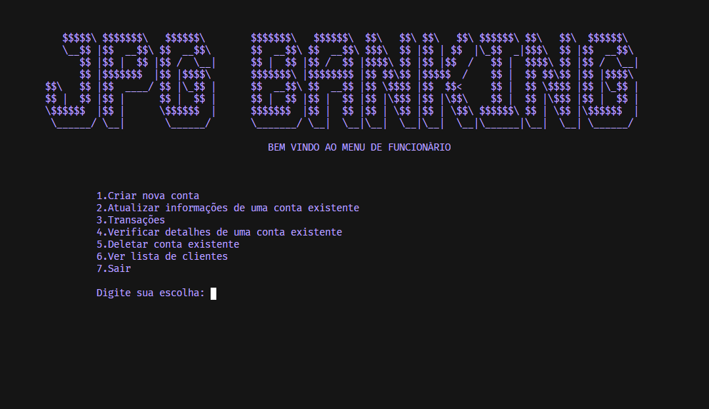
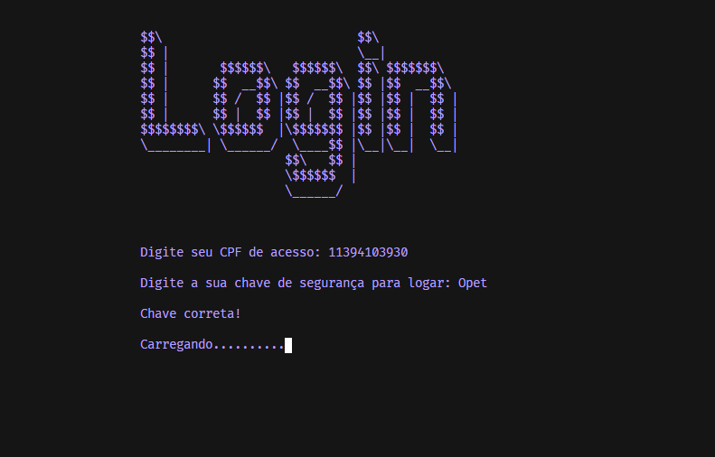
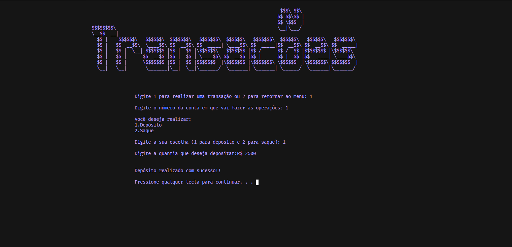
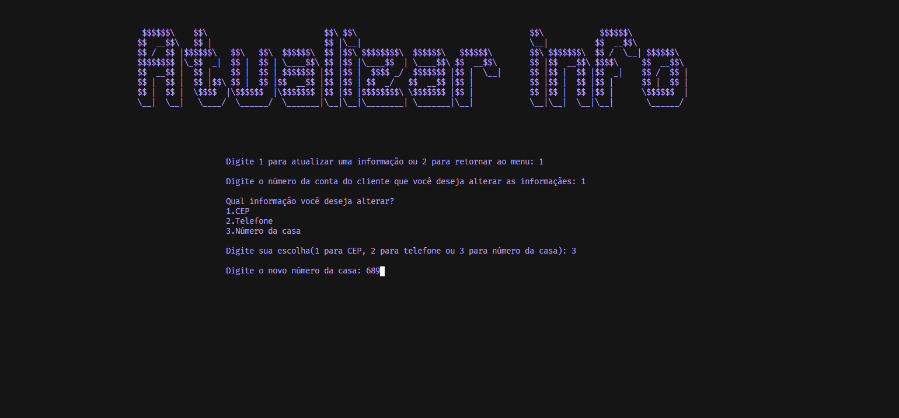

<!-- PROJECT LOGO -->
<br />
<p align="center">
  <a href="https://github.com/pscordeiro/JPG-Banking">
    
  </a>

  <h2 align="center">JPG Banking</h2>

  <p align="center">
    This is a college project that was developed with the purpose to optimize the time and improve the work of fictional bank employees in the 2000s , creating and storing customers data efficiently.
    <br />
    <a href="https://github.com/pscordeiro/JPG-Banking/issues">Report Bug</a>
    ·
    <a href="https://github.com/pscordeiro/JPG-Banking/issues">Request Feature</a>
  </p>
</p>


<!-- ABOUT THE PROJECT -->
## About The Project

<p>
    
  </a>
</p>

The system solve problems such as data loss and would manage space more efficiently because digital files can store an immense amount of data in a few centimeters, in addition to having easy and fast access to search the custumers informations stored in the database.

Here's why you should use JPG Banking:
* You can create and save a customer account in a few minutes
* You can access the file anytime and visualize all the information you register in the creation of the account.
* You save time


### Built With

* [C](https://docs.microsoft.com/en-us/cpp/c-language/?view=msvc-160)

<!-- GETTING STARTED -->
## Getting Started

### Prerequisites

* Windows as Operating System
* An IDE like VScode or similar
* A C compiler like MinGW

### Installation

1. Download and install [Visual Studio Code](https://visualstudio.microsoft.com/pt-br/downloads/)
2. Install the following extensions in VScode: 
    * [C/C++](https://marketplace.visualstudio.com/items?itemName=ms-vscode.cpptools)
    * [Code Runner](https://marketplace.visualstudio.com/items?itemName=formulahendry.code-runner)

3. Install and configure [MinGW](http://www.mingw.org/wiki/Getting_Started)

4. Clone the repo
   ```sh
   git clone https://github.com/pscordeiro/JPG-Banking.git
   ```
5. Run the code


<!-- USAGE EXAMPLES -->
## Usage

The system can be use to:
* Register users accounts in the database 
* Update existing information of the customers 
* Make transactions like deposits and withdraws 
* Check the informations about a specif account 
* Delete an accounts
* See all the custumers that are in the database (dat file).

## Previews:
### Login validation
<p>
    
</p>

### Transactions page
<p>
    
</p>

### Update info page
<p>
    
</p>


<!-- ROADMAP -->
## Roadmap

See the [open issues](https://github.com/pscordeiro/JPG-Banking/issues) for a list of proposed features (and known issues).


<!-- CONTRIBUTING -->
## Contributing

Contributions are what make the open source community such an amazing place to be learn, inspire, and create. Any contributions you make are **greatly appreciated**.

1. Fork the Project
2. Create your Feature Branch `git checkout -b feature/AmazingFeature`
3. Commit your Changes `git commit -m 'Add some AmazingFeature'`
4. Push to the Branch `git push origin feature/AmazingFeature`
5. Open a Pull Request


<!-- LICENSE -->
## License

Distributed under the MIT License. See `LICENSE` for more information.


<!-- CONTACT -->
## Contact

Paulo Cordeiro - [Twitter](https://twitter.com/v4ipc) - ps.cordeiro01@gmail.com - [LinkedIn](https://www.linkedin.com/in/pscordeiro/)

Project Link: [https://github.com/pscordeiro/JPG-Banking](https://github.com/pscordeiro/JPG-Banking)


<!-- MARKDOWN LINKS & IMAGES -->
<!-- https://www.markdownguide.org/basic-syntax/#reference-style-links -->
[product-screenshot]: imgs/menu.png
